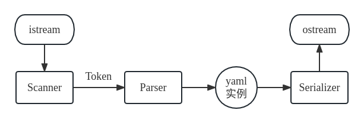

# 目录

* 1 [任务概述](#任务概述)
  * 1.1 [目标](#目标)
  * 1.2 [开发环境](#开发环境)
  * 1.3 [需求概述](#需求概述)
  * 1.4 [条件和限制](#条件和限制)
* 2 [总体设计](#总体设计)
  * 2.1 [程序流程](#程序流程)
  * 2.2 [组件功能](#组件功能)
  * 2.3 [数据结构](#数据结构)
* 3 [接口设计](#接口设计)
  * 3.1 [内部接口](#内部接口)
  * 3.2 [外部接口](#外部接口)
 

# 任务概述
## 目标
 YAML 是一种数据序列化语言，其语法简洁直观，通过空格缩进表示层级结构，在数据结构表达方面有较大优势，常用于编写配置文件。 
该项目的最终目标为实现一个C++的 YAML 库，使用递归下降分析法对 YAML 语言进行解析，实现对 YAML 的读写功能。 

## 开发环境
- OS:&nbsp;&nbsp;Ubuntu-20.04
- Editor:&nbsp;&nbsp;vscode
- Compiler:&nbsp;&nbsp;gcc-9.4.0
- Build:&nbsp;&nbsp;cmake-3.16.3
- VCS:&nbsp;&nbsp;git

## 需求概述
- 实现 YAML 相关类型&nbsp;&nbsp;null、object、array、int、real、string，且 string 类型实现保留换行和折叠换行
- 通过 std::istream 输入流读取 YAML 源数据
- 通过 std::ostream 输出流将 YAML 类型输出
- 根据 YAML 语法规则，使用递归下降子程序法实现 YAML 解析

## 条件和限制
- 标准:&nbsp;&nbsp;c++17
- 库:&nbsp;&nbsp;STL
- 禁止使用任何第三方库

# 总体设计
## 程序流程
对外部调用者， YAML 库主要提供了 YAML 类型的实现和 YAML 的读写接口。而 YAML 库内部则通过 Scanner、Parser、Serializer 三个组件实现相关的功能 

 

## 组件功能
该 YAML 库主要由以下组件组成
- Scanner:&nbsp;&nbsp;通过 istream 接收输入流，按顺序扫描源文本，进行词法分析，每次返回一个 token 
- Parser:&nbsp;&nbsp;接收来自 Scanner 生成的 token，在 token 的基础上进行语法分析，检测语法正确性并生成相应的 YAML 实例 
- Serializer:&nbsp;&nbsp;接收 YAML 实例，将该实例进行序列化并通过 ostream 将序列化后的内容输出到制定位置 

## 数据结构
1. Token:&nbsp;&nbsp;词法分析解析结果 
type:&nbsp;&nbsp;token 类型枚举值 
value:&nbsp;&nbsp;token 的原始字面量 

2. Value:&nbsp;&nbsp;YAML 类型 
type:&nbsp;&nbsp;Value 类型枚举值 
object:&nbsp;&nbsp;std::unordered_map YAML 对象 
array:&nbsp;&nbsp;std::vector YAML 数组 
scaler:&nbsp;&nbsp;std::string YAML 标量 
> 先用这种简单的设计，后面可以考虑构造一个树作为 YAML 的实现以及存储数据，Value不存储数据，只用作数据访问的接口，提供\[\]之类的操作符，通过树节点指针访问数据

# 接口设计
## 内部接口(组件互相调用或主程序调用)
Scanner:
1. next_token() 
功能:&nbsp;&nbsp;获取下一个 token 
参数:&nbsp;&nbsp;无 
返回值:&nbsp;&nbsp;一个 Token(Token) 

2. lineno() 
功能:&nbsp;&nbsp;获取当前行号，用于报告错误 
参数:&nbsp;&nbsp;无 
返回值:&nbsp;&nbsp;当前行号(unsigned int) 

3. colno() 
功能:&nbsp;&nbsp;获取当前列号，用于报告错误 
参数:&nbsp;&nbsp;无 
返回值:&nbsp;&nbsp;当前列号(unsigned int) 

## 外部接口
Parser:
1. parse() 
功能:&nbsp;&nbsp;开始解析 
参数:&nbsp;&nbsp;无 
返回值:&nbsp;&nbsp;YAML 类型对象(Value) 

Serializer:
1. serialize(Value &, ostream &) 
功能:&nbsp;&nbsp;将 YAML 类型对象序列化输出至给定 ostream 
参数1:&nbsp;&nbsp;Value 引用 
参数2:&nbsp;&nbsp;ostream 引用 
返回值:&nbsp;&nbsp;无 

2. serialize(Value &) 
功能:&nbsp;&nbsp;将 YAML 类型对象序列化为字符串 
参数:&nbsp;&nbsp;Value 引用 
返回值:&nbsp;&nbsp;序列化后的字符串(std::string) 
