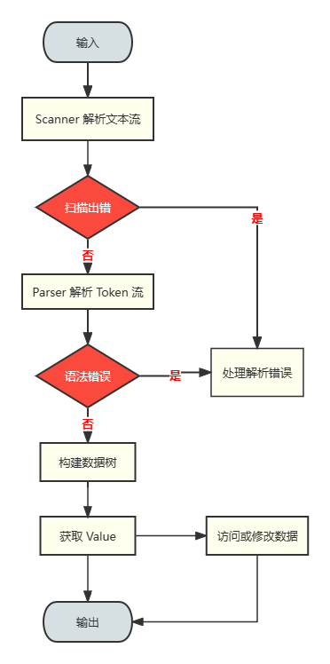

# 目录

* 1 [项目概述](#项目概述)
  * 1.1 [目标](#目标)
  * 1.2 [开发环境](#开发环境)
  * 1.3 [需求概述](#需求概述)
  * 1.4 [条件和限制](#条件和限制)
* 2 [总体设计](#总体设计)
  * 2.1 [系统结构](#系统结构)
  * 2.2 [程序流程](#程序流程)
* 3 [模块设计](#模块设计)
* 4 [数据设计](#数据设计)
  * 4.1 [枚举](#枚举)
  * 4.2 [类和结构体](#类和结构体)
* 5 [接口设计](#接口设计)
  * 5.1 [主要内部接口](#主要内部接口)
  * 5.2 [外部接口](#外部接口)
* 6 [错误处理](#错误处理)
  * 6.1 [异常](#异常)
 

# 项目概述
## 目标
YAML 是一种数据序列化语言，其语法简洁直观，通过空格缩进表示层级结构，在数据结构表达方面有较大优势，常用于编写配置文件。 
该项目的最终目标为实现一个 C++ 的 YAML 库，使用递归下降分析法对 YAML 语言进行解析，实现对 YAML 的读写功能。 
 

## 开发环境
- OS:&nbsp;&nbsp;Ubuntu-20.04
- Editor:&nbsp;&nbsp;vscode
- Compiler:&nbsp;&nbsp;gcc-9.4.0
- Build:&nbsp;&nbsp;cmake-3.16.3
- Test:&nbsp;&nbsp;googletest
- VCS:&nbsp;&nbsp;git
 

## 需求概述
- 基本需求
  - 实现对一下 YAML 类型&nbsp;&nbsp;null、object(map)、array(sequence)、int、real、string 的支持，且 string 类型实现保留换行和折叠换行
  - 实现对 std::istream 文本输入流的解析，包括但不限于 std::ifstream 文件输入流、std::cin 标准输入流、std::istringstream 字符串输入流
  - 根据需要支持的目标语法规则，计算等价的 YAML-LL(1) 文法，并使用递归下降分析法实现解析器
  - 实现对 YAML 数据的构建，能够正确构建 YAML 数据树
  - 实现对 YAML 数据的访问，包括增删查改等功能，并提供易用的数据访问接口
    - 对 map 和 sequence 提供类似于 std::unordered_map 和 std::vector 的接口
    - 对无法在编译期确定类型的标量，提供由模板实现的接口，同时确保运行时对数据进行类型检查
  - 实现对 YAML 数据的序列化
  - 实现通过 std::ostream 输出序列化后的 YAML 数据，包括但不限于 std::ofstream 文件输出流、std::cout 标准输出流、std::ostringstream 字符串输出流
- 拓展需求
  - 实现对子集 json 的支持
  - 实现关系树和数据形态
  - 实现基于事件的流式解析
  - 实现对 Unicode 的支持
 

## 条件和限制
- 使用的 C++ 标准:&nbsp;&nbsp;c++17
- 可使用的库:&nbsp;&nbsp;STL，禁止使用任何第三方库
 

# 总体设计
对外部调用者， YAML 库主要提供了 YAML 类型的实现和 YAML 的读写接口。而 YAML 库内部则通过 Scanner、Parser、Serializer 三个模块实现相关的功能 
## 系统结构
 
## 程序流程
 

# 模块设计
该 YAML 库主要由以下模块组成
- Scanner:&nbsp;&nbsp;通过 istream 接收输入流，按顺序扫描源文本，进行词法分析，每次返回一个 token 
- Parser:&nbsp;&nbsp;接收来自 Scanner 生成的 token，在 token 的基础上进行语法分析，检测语法正确性并构建 YAML 数据树 
- Serializer:&nbsp;&nbsp;序列化 YAML 数据，并通过 ostream 将序列化后的内容输出到制定位置 

# 数据设计
该部分描述了实现系统功能所用到的数据结构，包括枚举和类 
## 枚举
|  枚举类名   |        说明        |
| :---------: | :----------------: |
| Token_Type  |  表示 Token 类型   |
| Indent_Type | 表示 yaml 缩进类型 |
|  Node_Type  |  表示节点数据类型  |
 

## 类和结构体
| 类名   | 说明                                               |
| :----- | :------------------------------------------------- |
| Indent | 记录缩进类型和信息                                 |
| Mark   | 记录输入流当前读取的位置                           |
| Token  | 解析字符输入流得到的符号                           |
| Node   | yaml 数据节点                                      |
| Value  | 实例化后的 yaml 数据类型，封装了对 Node 的访问接口 |
 

### Node
| 变量           | 说明               |
| :------------- | :----------------- |
| type_          | 记录该 Node 类型   |
| map_data_      | 存储对象(映射)数据 |
| sequence_data_ | 存储数组(序列)数据 |
| scalar_data_   | 存储标量数据       |
 

### Value
> Value 类是 yaml 数据的实现，内部封装了对应的 Node 节点，并提供数据访问的接口函数

| 数据访问函数              | 说明                                     |
| :------------------------ | :--------------------------------------- |
| operator\[\](std::string) | 实现对 map 中数据的访问                  |
| operator\[\](uint32_t)    | 实现对 sequence 中数据的访问             |
| as\<T\>()                 | 使用模板实现实现对不同类型标量数据的访问 |
 

# 接口设计
## 主要内部接口
### Scanner
1. **char next_char()** 
功能:&nbsp;&nbsp;从输入流获取下一个字符 

2. **void scan()** 
功能:&nbsp;&nbsp;扫描输入流并解析一个 token 

3. **Token next_token()** 
功能:&nbsp;&nbsp;获取下一个 token 

4. **Token lookahead()** 
功能:&nbsp;&nbsp;向前查看下一个 token 
说明:&nbsp;&nbsp;该项目基于 YAML-LL(1) 文法实现，需要提供向前查看一个符号且不消耗该符号的功能 

5. **void push_indent(Indent_Type type)** 
功能:&nbsp;&nbsp;向栈中压入当前的缩进状态 
说明:&nbsp;&nbsp;根据缩进状态栈可以分析嵌套数据的层级关系 
参数1:&nbsp;&nbsp;当前缩进类型 

6. **void pop_indent()** 
功能:&nbsp;&nbsp;弹出缩进状态栈顶层元素 
说明:&nbsp;&nbsp;匹配缩进，闭合 map 或 sequence 

### Parser
1. **Token expect(Token_Type type)** 
功能:&nbsp;&nbsp;尝试接收一个 token 
说明:&nbsp;&nbsp;从 scanner 中接收一个 token，并判断其类型是否符合传入类型 
参数1:&nbsp;&nbsp;期望接收的 token 类型 

> Parser 使用递归下降实现，需要根据文法对每个产生式编写对应函数

### Serializer
暂无 

## 外部接口
### Parser
1. **Value parse()** 
功能:&nbsp;&nbsp;解析 yaml 并返回数据根节点的 Value 

### Serializer
1. **std::string serialize(Value &value)** 
功能:&nbsp;&nbsp;将 YAML 类型对象序列化 
参数1:&nbsp;&nbsp;Value 引用 

### Global APIs
1. **Value load()** 
功能:&nbsp;&nbsp;从标准输入流加载 yaml 

2. **Value load(std::string file)** 
功能:&nbsp;&nbsp;加载 yaml 文件 
参数1:&nbsp;&nbsp;输入文件路径 

3. **Value dump()** 
功能:&nbsp;&nbsp;输出 yaml 到标准输出 

4. **Value dump(std::string file)** 
功能:&nbsp;&nbsp;保存 yaml 数据到文件 
参数1:&nbsp;&nbsp;输出文件路径 

# 错误处理
运行出错时，cyaml 会抛出运行时异常 

## 异常

| 异常类型              | 基类                | 说明           |
| :-------------------- | :------------------ | :------------- |
| Exception             | std::runtime_error  | cyaml 异常基类 |
| Parse_Exception       | Exception           | 解析异常       |
| Represent_Exception   | Exception           | 数据表示异常   |
| Dereference_Exception | Represent_Exception | 数据解引用异常 |
| Convert_Exception     | Represent_Exception | 数据转换异常   |
 
